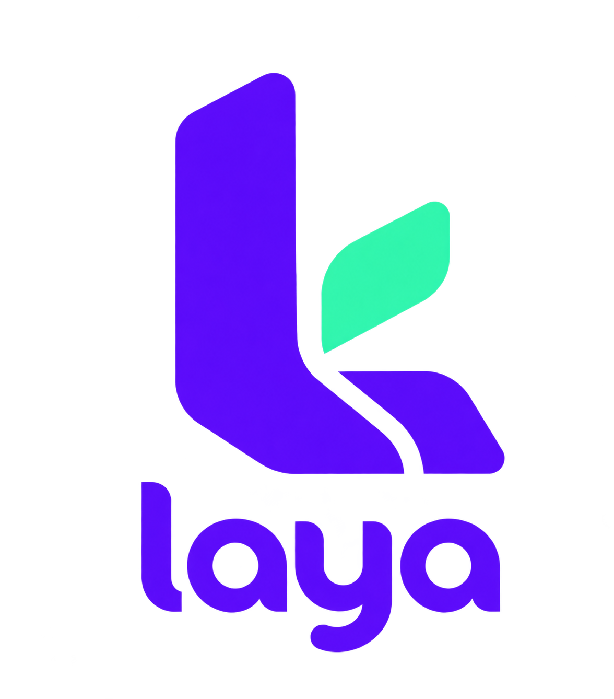
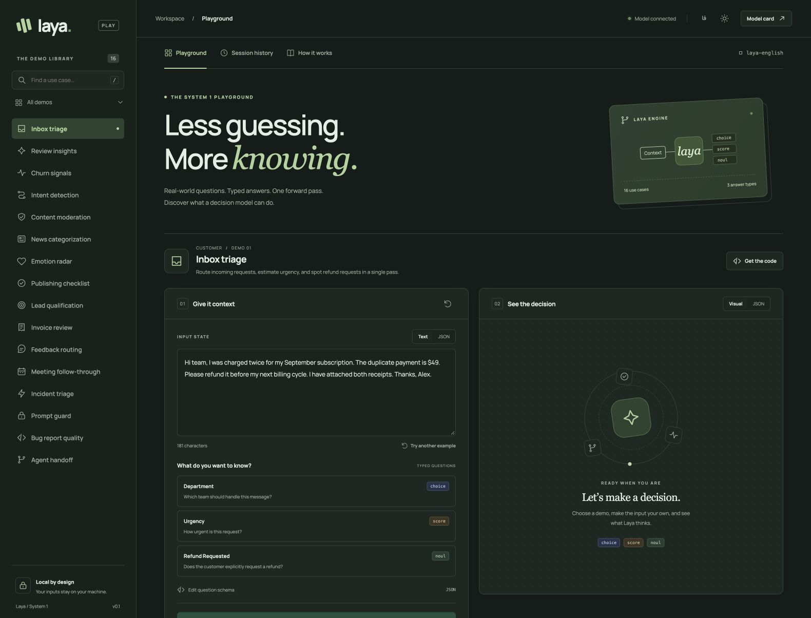

<p align="center">
  
</p>

<h1 align="center">Laya on Bun</h1>

Run Laya locally with **Bun, Hugging Face tokenizers, and native ONNX inference**. Ask structured questions, get typed decisions, and connect through the official `@typesafe-ai/sdk` using your own `baseURL`.

This monorepo includes an HTTP inference server and an English/Persian playground with 16 demos. Python is used once to export the pretrained model; serving runs entirely inside Bun.

[Quick start](#quick-start) · [SDK example](#use-the-official-sdk) · [Development](#development) · [Configuration](#configuration) · [Architecture](docs/architecture.md)

<p align="center">
  <a href="docs/images/playground.jpg">
    
  </a>
</p>
<p align="center">
  <strong>A playground for real-world decisions.</strong><br />
  16 interactive demos · English &amp; Persian · Local inference<br />
  <a href="#quick-start">Run it locally</a> · <a href="playground/README.md">Explore the playground</a>
</p>

## What you can build

Route support requests, classify feedback, score urgency, or check whether a condition is true. Laya evaluates the input against your questions and returns structured answers in one forward pass.

| Question type | Returns | Example |
| --- | --- | --- |
| `choice` | Selected label and probabilities for all options | Route a message to billing or support |
| `score` | Expected score on a zero-based ordered scale | Rate urgency from low to critical |
| `noul` | Probability that a statement is true | Detect an explicit refund request |

Laya does not generate text. The server implements TypeSafe's decision API so applications can use the existing SDK directly.

## Quick start

Run the commands below from the repository root.

### 1. Install dependencies

Use **Bun 1.4.2**, the version pinned in CI. Preparing the model also requires **Python 3.12** and **uv**. Allow several GB of disk space and RAM: the English source weights are approximately 820 MB, and the float32 ONNX model is approximately 1.6 GB, in addition to export dependencies.

```sh
bun install --frozen-lockfile
uv venv --python 3.12 .venv
uv pip install --python .venv/bin/python -r scripts/requirements-export.txt
```

### 2. Prepare the model once

```sh
bun run model:download
bun run model:export
bun run smoke
```

The downloader uses `@huggingface/hub` and a pinned model revision. The exporter converts the full encoder and decision head, compares ONNX outputs with PyTorch, and writes the serving artifacts to `models/english/onnx`.

The smoke check starts its own temporary HTTP server, checks JavaScript/Python token parity, and compares real SDK responses against the exported reference fixtures. It does not require a separately running server.

Already have a complete exported model directory? Set `LAYA_MODEL_DIR` to its path and skip download/export. Python is not needed for serving.

### 3. Start the API and playground

```sh
# Terminal 1: inference API
bun start
```

```sh
# Terminal 2: interactive playground
bun run playground
```

Open the [playground](http://127.0.0.1:3001/) or check [API health](http://127.0.0.1:3000/health). The API becomes available after the model has loaded.

Subsequent runs need only these two commands.

## Use the official SDK

The SDK is already installed in this workspace. In another Bun application, install it with `bun add @typesafe-ai/sdk`.

```ts
import { TypeSafeClient, choice, noul, score } from '@typesafe-ai/sdk';

const client = new TypeSafeClient({
  baseURL: 'http://127.0.0.1:3000',
  apiKey: process.env.LAYA_API_KEY ?? 'local-development',
  defaultModel: 'laya',
  timeout: 60_000,
});

const result = await client.systemOne({
  state: 'I was charged twice. Please refund the duplicate payment.',
  questions: {
    department: choice('Which team should handle this?', {
      billing: 'Payments and refunds',
      technical: 'Bugs and outages',
    }),
    urgency: score('How urgent is this request?', ['Low', 'Medium', 'High']),
    refund: noul('Is a refund explicitly requested?'),
  },
});

// Inferred as 'billing' | 'technical'.
console.log(result.answers.department.choice);
console.log(result.answers.department.probabilities);
console.log(result.answers.urgency.score);
console.log(result.answers.refund.noul);
```

Run the included example against the running API:

```sh
bun examples/triage.ts
```

Set `defaultModel: 'laya'` explicitly; the SDK's default `jev-latest` is not served here. The SDK requires a nonempty API key even when local authentication is disabled. When `LAYA_API_KEY` is configured on the server, use that same key in your client.

### Reading the answers

- **Choice:** the winning label's probability appears in `probabilities[choice]`.
- **Score:** the expected ordinal value can fall between levels; it is not rounded to a class.
- **Confidence:** for choice and score, this is `1 − normalized entropy`. It measures concentration of the distribution, not accuracy or the winning label's probability.
- **Noul:** a value from `0` to `1` representing the probability of `true`.

Predictions require evaluation on your own data. API compatibility does not imply identical accuracy or calibration to TypeSafe's hosted models.

## Playground

The [playground guide](playground/README.md) covers all controls and serving options. Included features:

- 16 demos across customer support, content, business, and engineering.
- Two input examples per demo in each language, with localized questions, answer labels, and scoring criteria.
- English/Persian switching, RTL layout, and light/dark themes.
- Editable text or JSON input, editable question schemas, probability charts, and raw results.
- Session history and copyable code using the official SDK.

Requests go through the playground's server to the model API; the API key stays server-side. Language and theme preferences persist locally. Input drafts and results stay in memory and disappear on reload.

**Switching UI language does not switch the model.** The default checkpoint is English. Persian examples are sent directly in Persian; valid responses demonstrate API operation, not verified Persian prediction quality.

## Development

```sh
bun run dev                  # Watch and restart the inference server
bun run playground           # Playground with hot reload
bun run typecheck            # TypeScript checks
bun test                     # Lightweight tests; no model required
bun run playground:build     # Build the playground for production
```

For real-model checks:

```sh
# Requires an exported model; starts its own temporary server
bun run smoke

# Require both the inference API and playground to be running
bun playground/smoke.ts
DEMO_LANGUAGE=fa bun playground/smoke.ts
```

Each playground smoke run evaluates 32 examples in the selected language and validates response structure. CI runs dependency installation, typechecking, and lightweight tests without downloading model weights. See the [verification report](docs/verification.md) for the scope of the numerical parity checks.

### Workspace layout

| Package / path | Responsibility |
| --- | --- |
| `laya-bun` — repository root | Workspace scripts and model preparation tools |
| `@laya/server` — `apps/server` | Elysia API, authentication, validation, and request queue |
| `@laya/runtime` — `packages/runtime` | Tokenization, sequence packing, native ONNX execution, and decoding |
| `@laya/playground` — `playground` | Browser UI and server-side SDK connection |
| `scripts` | Checkpoint download, Python export, and parity verification |
| `examples` | Runnable SDK integration examples |
| `tests` | API contracts, validation, and playground boundary tests |

To add a demo, define its English examples and questions in [`playground/src/demos.ts`](playground/src/demos.ts), Persian payloads in [`playground/src/demos-fa.ts`](playground/src/demos-fa.ts), and translated descriptions in [`playground/src/i18n.ts`](playground/src/i18n.ts). Update the displayed demo counts when changing the library size, then run the relevant playground smoke checks.

## Configuration

Defaults work for local development. Copy [`.env.example`](.env.example) to `.env` for overrides; Bun loads it automatically. Paths below are relative to the repository root unless absolute.

| Variable | Default | Purpose |
| --- | --- | --- |
| `HOST` | `127.0.0.1` | Inference API bind address |
| `PORT` | `3000` | Inference API port |
| `LAYA_MODEL_DIR` | `models/english/onnx` when serving | Complete exported model directory |
| `LAYA_API_KEY` | unset on API | Bearer authentication for `/v1/*`; also used by clients |
| `PLAYGROUND_HOST` | `127.0.0.1` | Playground bind address |
| `PLAYGROUND_PORT` | `3001` | Playground port |
| `LAYA_BASE_URL` | `http://127.0.0.1:3000` | Model API used by the playground |
| `LAYA_CHECKPOINT` | `english` | Download/export selection: `english`, `multilingual`, or `typed-decisions` |
| `LAYA_SOURCE_DIR` | `models/<checkpoint>/source` | Source files for download/export |
| `HF_TOKEN` | unset | Optional authenticated Hugging Face downloads |

During export, `LAYA_MODEL_DIR` defaults to `models/<checkpoint>/onnx`. The playground uses `local-development` as its SDK key if `LAYA_API_KEY` is unset.

### Use another checkpoint

```sh
LAYA_CHECKPOINT=multilingual bun run model:download
LAYA_CHECKPOINT=multilingual LAYA_MODEL_DIR=models/multilingual/onnx bun run model:export
LAYA_MODEL_DIR=models/multilingual/onnx bun run smoke
LAYA_MODEL_DIR=models/multilingual/onnx bun start
```

Download/export selects the checkpoint; serving loads the directory given by `LAYA_MODEL_DIR`. Each server process holds one checkpoint. Requests accept `laya` or the resident checkpoint name, such as `laya-english`; they do not switch checkpoints dynamically.

The English checkpoint has been exported and parity-checked locally. Multilingual and typed-decisions checkpoints need their own successful export and verification before use.

## HTTP API

| Method | Path | Purpose |
| --- | --- | --- |
| `GET` | `/health` | Readiness, resident checkpoint, and revision; no authentication |
| `GET` | `/v1/models` | List the resident model; available through `client.models.list()` |
| `POST` | `/v1/systemone` | Evaluate `state` against typed `questions` |

Requests accept text, JSON objects/arrays, or `null` as state. The server limits bodies to 1 MiB, questions to 32, and options per question to 32. Option token budgets are validated; long input state is truncated to the checkpoint's token budget.

At most eight requests are admitted, with one native forward pass running at a time. Excess traffic receives `429` and `Retry-After`. Queued cancelled requests are skipped; native inference already in progress cannot be interrupted. Output token usage is zero because the model does not generate text.

## Docker

The multi-stage [Dockerfile](Dockerfile) produces separate `server` and `playground` images. Both run as a non-root user. The API image contains the bundled application and native CPU runtime for the build architecture; the playground contains only its production bundle. Python, development dependencies, and model weights are excluded from the final images.

### Start with Compose

Prepare the model with the [quick start](#quick-start) first, then run:

```sh
docker compose up --build -d --wait
```

Open the [playground](http://127.0.0.1:3001/) or connect the SDK to `http://127.0.0.1:3000`. Compose mounts `models/english/onnx` read-only and waits for the API health check before starting the playground. Both host ports bind to localhost.

If the local Bun services already occupy those ports:

```sh
DOCKER_API_PORT=3100 DOCKER_PLAYGROUND_PORT=3101 docker compose up --build -d --wait
```

The playground connects internally to `http://server:3000`, regardless of host port overrides.

| Variable | Default | Compose behavior |
| --- | --- | --- |
| `LAYA_MODEL_DIR` | `./models/english/onnx` | Host directory mounted at `/models`; must already exist |
| `LAYA_API_KEY` | `local-development` | Shared API/client key; replace it outside local development |
| `DOCKER_API_PORT` | `3000` | Host port for the model API |
| `DOCKER_PLAYGROUND_PORT` | `3001` | Host port for the playground |

Compose reads these values from the shell or `.env`. Keep the **entire exported model directory** together, including the manifest, tokenizer files, and any external ONNX weight files. No model download or Python export runs at container startup.

```sh
docker compose ps
docker compose logs -f server playground
docker compose down
```

Stopping the stack does not delete the host model files. Allow sufficient memory in Docker Desktop for the resident model and any other running containers. A 4 GiB Docker VM shared with database services ran out of memory during model loading in local testing. If you see exit code `137` and `OOMKilled: true`, increase the Docker VM memory allocation or free memory before retrying; the small image size does not represent inference RAM usage.

Local `linux/arm64` builds measured approximately **313 MB for the API** and **275 MB for the playground** (Docker-reported image size, excluding the mounted model). Both images built successfully; the native ONNX binding loaded, and the playground served HTML/JS/CSS and reported the unavailable API correctly. Full model inference inside Docker remains unverified because of the memory limit described above.

### Build individual images

```sh
docker build --target server -t laya-bun-server:local .
docker build --target playground -t laya-bun-playground:local .
```

Bun is pinned to `1.4.2`; override it with `--build-arg BUN_VERSION=...` only after checking compatibility. Build on the target architecture (or use Docker Buildx for `linux/amd64` / `linux/arm64`) so the native ONNX binding matches the container. The CPU runtime uses a Debian/glibc base.

### Serve without Docker

On a machine with Bun and the workspace dependencies installed:

```sh
LAYA_MODEL_DIR=/absolute/path/to/onnx bun start
```

Python, `.venv`, and the original source weights are not required. To serve the built playground alongside the API:

```sh
bun run playground:build
NODE_ENV=production bun playground/dist/server.js
```

The playground is intended for local development and does not provide a separate user authentication system.

## Troubleshooting

| Symptom | Check |
| --- | --- |
| Model fails to load | Confirm `LAYA_MODEL_DIR` points to a complete export; rerun export if the manifest is missing. |
| Playground shows offline | Start the inference API and check `/health`; confirm `LAYA_BASE_URL` and the API key match. |
| Unknown model error | Set `defaultModel: 'laya'` or use the resident name returned by `/v1/models`. |
| API returns `401` | Match the client key to the server's `LAYA_API_KEY`. |
| API returns `429` | Reduce concurrency and retry after the indicated delay. |
| Unexpected Persian predictions | The default model is English; changing the interface language does not load a multilingual checkpoint. |

## Model and attribution

This project runs [Laya by ConvAI Innovations](https://huggingface.co/convaiinnovations/laya), using its [upstream implementation](https://github.com/NandhaKishorM/laya). The vendored reference code's Apache-2.0 license is preserved in [`licenses/Laya-Apache-2.0.txt`](licenses/Laya-Apache-2.0.txt).

See [architecture and source references](docs/architecture.md) for the pinned model revision, export design, and dependency attribution.
